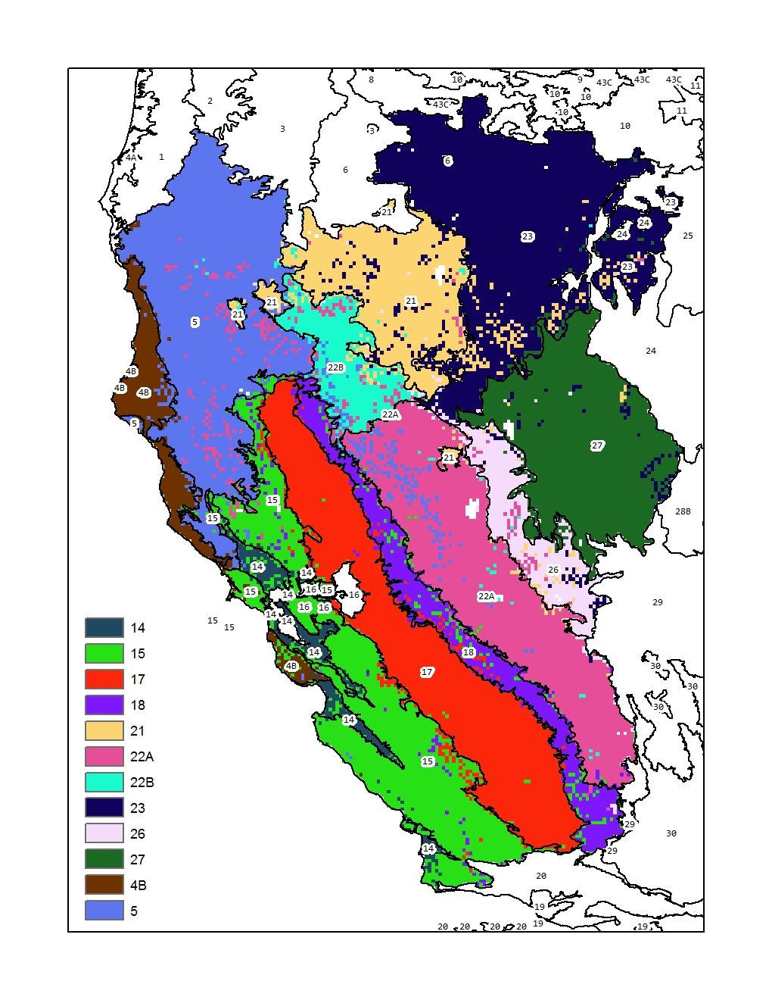

# Collect Raster Samples for CONUS MLRA

## Data Sources

 1. 800m PRISM:
    + elevation
    + effective PPT
    + frost-free days
    + MAAT
    + MAP
    + growing degree days
    + fraction of annual PPT as rain
    + monthly PPT (mm)
    + monthly PPT - PET (mm)
 2. 30m geomorphon proportions
 3. 30m NLCD (2011) proportions
 4. 800m CONUS SSURGO | STATSGO:
    + CEC 0-25cm
    + plant available water storage 0-25cm
    + pH 0-25cm
 5. CONUS radiometric survey data
 6. 2015 population counts

## New Data:
  * 2017 NASS / CropSCape
  * long-term average vegetation indices (NDVI, etc.)
  * impervious surfaces

## Get Latest MLRA Raster Sample Database
The following 3 commands will download the three raster sample databases to your home directory. Adjust `destfile` paths as needed. The files should be placed in the MLRA Summary report folder. [See the detailed instructions on report setup and useage](https://github.com/ncss-tech/soilReports/tree/master/inst/reports/region2/mlra-comparison).

```r
# landform elements via geomorphons algorithm
download.file('https://github.com/ncss-tech/mlra-raster-db/raw/master/rda-files/mlra-geomorphons-data.rda', 
destfile='MLRA-comparison/mlra-geomorphons-data.rda')

# NLCD
download.file('https://github.com/ncss-tech/mlra-raster-db/raw/master/rda-files/mlra-nlcd-data.rda', 
destfile='MLRA-comparison/mlra-nlcd-data.rda')

# 800m PRISM stack
download.file('https://github.com/ncss-tech/mlra-raster-db/raw/master/rda-files/mlra-prism-data.rda', 
destfile='MLRA-comparison/mlra-prism-data.rda')

# monthly PPT 800m PRISM stack
download.file('https://github.com/ncss-tech/mlra-raster-db/raw/master/rda-files/mlra-monthly-ppt-data.rda', 
destfile='MLRA-comparison/mlra-monthly-ppt-data.rda')

# monthly PET 800m PRISM stack
download.file('https://github.com/ncss-tech/mlra-raster-db/raw/master/rda-files/mlra-monthly-pet-data.rda', 
destfile='MLRA-comparison/mlra-monthly-pet-data.rda')

# ISSR-800 soil properties
download.file('https://github.com/ncss-tech/mlra-raster-db/raw/master/rda-files/mlra-soil-data.rda', 
destfile='MLRA-comparison/mlra-soil-data.rda')

# gamma radiometrics
download.file('https://github.com/ncss-tech/mlra-raster-db/raw/master/rda-files/mlra-namrad-data.rda', 
destfile='MLRA-comparison/mlra-namrad-data.rda')

# 2015 population density
download.file('https://github.com/ncss-tech/mlra-raster-db/raw/master/rda-files/mlra-pop2015-data.rda', 
destfile='MLRA-comparison/mlra-pop2015-data.rda')
```

## Spatial Neighborhood Information
Details pending.


## MLRA Similarity and Membership Model

We have developed a new approach for defining, testing, and managing MLRA and LRU concepts using multivariate signatures derived from a suite of gridded (800m) climate and soil properties. This database of signatures is constantly updated as concepts change (e.g. MLRA and LRU lines re-drawn) and evaluated for internal consistency with a supervised classification framework. Predictions generated by the supervised classification model graphically demonstrate where MLRA and LRU concepts are more or less well defined, and the level of overlap that may or may not occur at boundaries.



MLRA concept coherency as derived from a supervised classification of select MLRA signatures from the western USA. Suspected "overlap" between similar MLRA concepts (22A-5, 18-15, 21-23, etc.) can be readily evaluated using maps like this.


