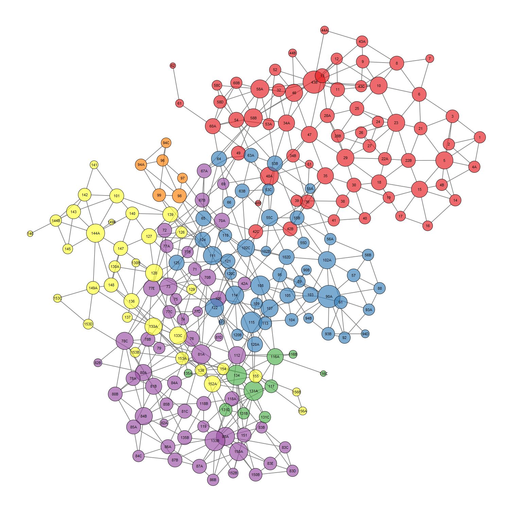

# Collect Raster Samples for CONUS MLRA

## Data Sources

 1. 800m PRISM:
    + elevation
    + effective PPT
    + frost-free days
    + MAAT
    + MAP
    + growing degree days
    + fraction of annual PPT as rain
 2. 30m geomorphon proportions
 3. 30m NLCD (2011) proportions
 4. 800m CONUS SSURGO | STATSGO:
    + CEC 0-25cm
    + plant available water storage 0-25cm
    + pH 0-25cm
 5. CONUS radiometric survey data
 6. 2015 population counts

## New Data:
  * 2017 NASS / CropSCape
  * long-term average vegetation indices (NDVI, etc.)
  * impervious surfaces

## Get Latest MLRA Raster Sample Database
The following 3 commands will download the three raster sample databases to your home directory. Adjust `destfile` paths as needed. The files should be placed in the MLRA Summary report folder. [See the detailed instructions on report setup and useage](https://github.com/ncss-tech/soilReports/tree/master/inst/reports/region2/mlra-comparison).

```r
download.file('https://github.com/ncss-tech/mlra-raster-db/raw/master/rda-files/mlra-geomorphons-data.rda', 
destfile='MLRA-comparison/mlra-geomorphons-data.rda')

download.file('https://github.com/ncss-tech/mlra-raster-db/raw/master/rda-files/mlra-nlcd-data.rda', 
destfile='MLRA-comparison/mlra-nlcd-data.rda')

download.file('https://github.com/ncss-tech/mlra-raster-db/raw/master/rda-files/mlra-prism-data.rda', 
destfile='MLRA-comparison/mlra-prism-data.rda')

download.file('https://github.com/ncss-tech/mlra-raster-db/raw/master/rda-files/mlra-soil-data.rda', 
destfile='MLRA-comparison/mlra-soil-data.rda')

download.file('https://github.com/ncss-tech/mlra-raster-db/raw/master/rda-files/mlra-namrad-data.rda', 
destfile='MLRA-comparison/mlra-namrad-data.rda')

download.file('https://github.com/ncss-tech/mlra-raster-db/raw/master/rda-files/mlra-pop2015-data.rda', 
destfile='MLRA-comparison/mlra-pop2015-data.rda')
```

## Spatial Neighborhood Information
Details pending.




